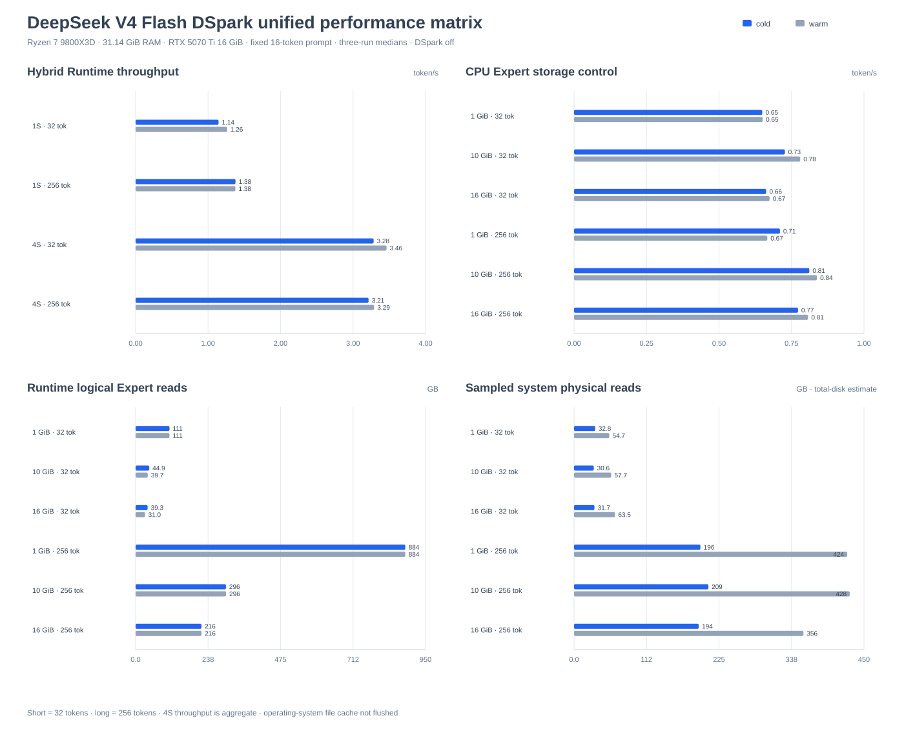

# ncnn MoE Runtime

>❗This software is in the early development stage

ncnn MoE Runtime is a lightweight, high-performance C++20 inference engine for
sparse Mixture-of-Experts models, built on
[Tencent/ncnn](https://github.com/Tencent/ncnn). Model adapters lower external
packages into a model-neutral `MoeIR`; the Runtime compiles that IR into an
execution graph and schedules Dense Transformer work, routing, and sparse
Experts across CPU, Vulkan, memory, and storage backends.

The runtime targets local inference on Desktop and edge-class systems where the
complete model may be larger than available RAM. The public API is independent
of a model family, device vendor, and fixed cache size. The distributed release
includes validated GPT-OSS and DeepSeek-V4-Flash-DSpark adapters for their
official Safetensors packages.

[Runtime capabilities](#runtime-capabilities) | [Architecture](#architecture) |
[Unified performance](#unified-reference-performance) |
[Quick start](#quick-start)

## Unified reference performance

GPT-OSS and DeepSeek-V4-Flash-DSpark use model-specific adapters and prompts,
while the scheduling, cache, graph, backend, workload, warm-up, and reporting
contracts remain model-neutral.

Both matrices use a fixed model-valid 16-token prompt, greedy decoding, three
fresh measured processes per case (and per cache size in the sweep), and
generated-token parity validation. Short means 32 generated tokens and long
means 256 generated tokens. Cold uses
`warmup=0` and `cache-warmup-runs=0`. Warm uses one unreported
`warmup=1` generation run plus one unreported
`cache-warmup-runs=1` cache run before the three measured samples;
it warms the actual execution path but does not promise that every routed
Expert remains resident.

The host is a Ryzen 7 9800X3D with 31.14 GiB RAM, an RTX 5070 Ti 16 GiB,
AVX-512 MXFP4 Expert kernels, ncnn Vulkan execution, and greedy decoding.
Throughput is the median of the three measured samples. Multi-session rows
report aggregate token/s.

Generated matrices use
`build-reports/performance-matrix/<model-family>/report.json`; runner build
directories remain independent from report ownership.

### GPT-OSS


The chart uses the same published matrix as the tables below: blue bars are
cold runs, gray bars are warm runs, and the two read panels separate Runtime
logical Expert traffic from sampled system physical traffic. The teal panel
contains the named short-text reference points.
Regenerate it after a new matrix with
`python tools\generate_performance_chart.py --family gpt-oss`.

#### Short-text reference points

These representative short-text measurements use their named workload
settings and are retained alongside the unified matrix. They are not a
replacement for the fixed 32/256-token cold/warm protocol above.

| Scenario | Median throughput |
| --- | ---: |
| GPT-OSS-120B cold start, 1 × 32 | **3.294 token/s** |
| GPT-OSS-120B warm cache, 1 × 32 | **11.045 token/s** |
| GPT-OSS-120B concurrent, 2 × 16 | **20.510 aggregate token/s** |
| GPT-OSS-120B long concurrent, 2 × 96 | **9.778 aggregate token/s** |
| GPT-OSS-20B eager, 1 × 64 | **16.898 token/s** |

#### Hybrid Runtime

These rows use Vulkan Dense/Attention with CPU Experts, on-demand Expert
residency, and the Runtime scheduler. The 20B path uses eager Expert
residency; 120B rows use a bounded host ARC.

| Workload | Window | Warm-up | Throughput | Peak RSS | ARC hit | Runtime reads |
| --- | --- | --- | ---: | ---: | ---: | ---: |
| GPT-OSS-20B, one Session | Short | No | **14.103 token/s** | 17.18 GiB | n/a | n/a |
| GPT-OSS-20B, one Session | Short | Yes | **14.855 token/s** | 17.18 GiB | n/a | n/a |
| GPT-OSS-20B, one Session | Long | No | **17.069 token/s** | 17.18 GiB | n/a | n/a |
| GPT-OSS-20B, one Session | Long | Yes | **16.597 token/s** | 17.19 GiB | n/a | n/a |
| GPT-OSS-120B, one Session | Short | No | **2.885 token/s** | 23.26 GiB | 66.7% | 24.6 GB |
| GPT-OSS-120B, one Session | Short | Yes | **4.718 token/s** | 23.32 GiB | 84.6% | 11.4 GB |
| GPT-OSS-120B, one Session | Long | No | **4.971 token/s** | 23.29 GiB | 82.9% | 85.5 GB |
| GPT-OSS-120B, one Session | Long | Yes | **5.171 token/s** | 23.35 GiB | 84.3% | 78.7 GB |
| GPT-OSS-120B, two Sessions | Short | No | **5.284 aggregate token/s** | 25.24 GiB | 81.6% | 24.4 GB |
| GPT-OSS-120B, two Sessions | Short | Yes | **10.916 aggregate token/s** | 25.34 GiB | 96.2% | 2.6 GB |
| GPT-OSS-120B, two Sessions | Long | No | **9.870 aggregate token/s** | 25.34 GiB | 91.9% | 70.0 GB |
| GPT-OSS-120B, two Sessions | Long | Yes | **10.295 aggregate token/s** | 25.31 GiB | 93.1% | 55.3 GB |

#### GPT-OSS-120B CPU Expert storage sweep

This control path keeps Expert execution on the CPU and varies the bounded
ARC cache. Each cache size has the same short/long and cold/warm protocol.
Runtime reads are Expert-cache logical bytes.

| Window | Warm-up | 1 GiB | 10 GiB | 16 GiB |
| --- | --- | ---: | ---: | ---: |
| Short | No | 1.042 token/s | 1.812 token/s | **2.119 token/s** |
| Short | Yes | 1.050 token/s | 2.006 token/s | **2.444 token/s** |
| Long | No | 1.143 token/s | 2.145 token/s | **2.637 token/s** |
| Long | Yes | 1.133 token/s | 2.160 token/s | **2.636 token/s** |

| Window | Warm-up | 1 GiB reads | 10 GiB reads | 16 GiB reads |
| --- | --- | ---: | ---: | ---: |
| Short | No | 73.9 GB | 34.7 GB | 26.6 GB |
| Short | Yes | 73.8 GB | 29.5 GB | 20.8 GB |
| Long | No | 500.0 GB | 183.7 GB | 115.0 GB |
| Long | Yes | 500.0 GB | 182.1 GB | 115.4 GB |

Sampled system physical reads for the same sweep were:

| Window | Warm-up | 1 GiB | 10 GiB | 16 GiB |
| --- | --- | ---: | ---: | ---: |
| Short | No | 57.8 GB | 26.0 GB | 19.1 GB |
| Short | Yes | 114.4 GB | 50.6 GB | 37.6 GB |
| Long | No | 392.1 GB | 140.8 GB | 88.4 GB |
| Long | Yes | 783.5 GB | 285.5 GB | 174.8 GB |

Peak RSS for the 1/10/16 GiB rows is approximately 4.1/13.2/19.2 GiB.
The JSON report also records ARC hit rate, process logical reads, and sampled
system physical reads. System physical reads are a Windows CIM
one-second total-disk estimate and include unrelated system traffic; they
are not process-attributed SSD traffic.

Run the complete matrix with:

```powershell
python tools\benchmark_reference_matrix.py gpt-oss `
  --runner .\build-ncnn\Release\ncnn_moe_gpt_oss.exe `
  --model-20b .\models\gpt-oss\gpt-oss-20b `
  --model-120b .\models\gpt-oss\gpt-oss-120b `
  --output-dir .\build-reports\performance-matrix\gpt-oss `
  --repeats 3 --short-tokens 32 --long-tokens 256 `
  --vulkan-device-index 0
```

The aggregate JSON is written to
`build-reports/performance-matrix/gpt-oss/report.json`.
These are GPT-OSS reference results on the stated Windows/x86 host, not a
direct cross-hardware comparison with another MoE model.

### DeepSeek-V4-Flash-DSpark

DeepSeek uses 16 repeated BOS token IDs and disables speculative decoding for
this matrix. Hybrid rows use Vulkan Dense projections with CPU Attention/cache
logic and CPU Experts, buffered Expert I/O, and a 16 GiB host ARC.
Four-Session rows force staged scheduling for exact long-window token parity
and report aggregate throughput.



The chart contains the complete fixed matrix: Hybrid throughput, CPU storage
throughput, Runtime logical Expert reads, and sampled system physical reads.
Regenerate it after a new matrix with
`python tools\generate_performance_chart.py --family deepseek-v4`.

#### Hybrid Runtime

| Workload | Window | Warm-up | Throughput | Peak RSS | ARC hit | Runtime reads |
| --- | --- | --- | ---: | ---: | ---: | ---: |
| One Session | Short | No | **1.144 token/s** | 24.07 GiB | 66.2% | 37.6 GB |
| One Session | Short | Yes | **1.264 token/s** | 23.85 GiB | 69.4% | 34.0 GB |
| One Session | Long | No | **1.378 token/s** | 24.02 GiB | 74.8% | 222.8 GB |
| One Session | Long | Yes | **1.377 token/s** | 23.95 GiB | 75.0% | 221.2 GB |
| Four Sessions | Short | No | **3.284 aggregate token/s** | 24.06 GiB | 76.3% | 38.4 GB |
| Four Sessions | Short | Yes | **3.462 aggregate token/s** | 23.86 GiB | 79.0% | 34.1 GB |
| Four Sessions | Long | No | **3.214 aggregate token/s** | 23.82 GiB | 76.6% | 219.1 GB |
| Four Sessions | Long | Yes | **3.291 aggregate token/s** | 23.68 GiB | 76.8% | 216.8 GB |

#### CPU Expert storage control

| Window | Warm-up | 1 GiB | 10 GiB | 16 GiB |
| --- | --- | ---: | ---: | ---: |
| Short | No | 0.649 token/s | **0.727 token/s** | 0.663 token/s |
| Short | Yes | 0.650 token/s | **0.780 token/s** | 0.674 token/s |
| Long | No | 0.710 token/s | **0.812 token/s** | 0.773 token/s |
| Long | Yes | 0.667 token/s | **0.838 token/s** | 0.807 token/s |

| Window | Warm-up | 1 GiB reads | 10 GiB reads | 16 GiB reads |
| --- | --- | ---: | ---: | ---: |
| Short | No | 111.1 GB | 44.9 GB | 39.3 GB |
| Short | Yes | 111.1 GB | 39.7 GB | 31.0 GB |
| Long | No | 883.8 GB | 296.0 GB | 216.1 GB |
| Long | Yes | 883.8 GB | 296.4 GB | 216.3 GB |

Sampled system physical reads for the same cells were:

| Window | Warm-up | 1 GiB | 10 GiB | 16 GiB |
| --- | --- | ---: | ---: | ---: |
| Short | No | 32.8 GB | 30.6 GB | 31.7 GB |
| Short | Yes | 54.7 GB | 57.7 GB | 63.5 GB |
| Long | No | 196.1 GB | 208.5 GB | 193.6 GB |
| Long | Yes | 424.1 GB | 428.0 GB | 356.1 GB |

Peak RSS for the 1/10/16 GiB controls was approximately
8.52/17.54/23.43 GiB. The 10 GiB ARC was fastest in every CPU cell on this
host. The 16 GiB ARC reduced Runtime logical reads but used about 5.9 GiB more
peak RSS and remained slower.

The 256-token runs cross the model's 128-token compressed-history boundary
and retain exact generated-token parity across all three samples. The
operating-system file cache was not flushed. System physical reads are a
one-second Windows CIM total-disk estimate and are not process-attributed SSD
traffic. This is raw-token throughput validation, not official tokenizer,
chat-template, or text-quality parity. It also does not establish a DSpark
speedup because speculative decoding is disabled.

Run the complete matrix with:

```powershell
python tools\benchmark_reference_matrix.py deepseek-v4 `
  --runner .\build-ncnn\Release\ncnn_moe_deepseek_v4.exe `
  --model .\models\deepseek-v4\DeepSeek-V4-Flash-DSpark `
  --output-dir .\build-reports\performance-matrix\deepseek-v4 `
  --repeats 3 --short-tokens 32 --long-tokens 256 `
  --parallel-sessions 4 --host-memory-mb 28672 `
  --expert-cache-mb 16384 `
  --storage-cache-mb 1024 10240 16384 `
  --expert-io-workers 4 --vulkan-device-index 0 --resume
```

The aggregate JSON was written to the build-local
`build-reports/performance-matrix/deepseek-v4/report.json`.
See the [DeepSeek execution guide](models/deepseek-v4/README.md) for model
setup and runtime options.

## Sparse models beyond resident memory

Large MoE models contain many Expert weights while each token activates only a
small routed subset. ncnn MoE Runtime treats Experts as schedulable,
cacheable Runtime objects instead of requiring every Expert to remain resident.
Dense tensors can stay memory-mapped, while active Expert pairs move through
bounded host and device cache tiers backed by asynchronous range I/O.

| Runtime concern | Mechanism |
| --- | --- |
| Model integration | `IMoeModelAdapter` lowers package metadata and weights into `MoeIR` |
| Compilation | Validation, normalization, weight resolution, graph construction, and backend placement |
| Dense Transformer | Portable CPU, ncnn CPU operators, or ncnn Vulkan |
| Sparse Experts | Stable Top-K grouping, batched execution, and runtime-selected kernels |
| Weight residency | Automatic eager or byte-bounded on-demand Expert storage |
| Cache policy | Host ARC with independent optional Vulkan execution and victim tiers |
| Scheduling | Dependency waves, backend events, and cross-Session micro-batching |

The Runtime therefore scales with the active Expert working set rather than
requiring a resident copy of every routed weight.

## Runtime capabilities

| Area | Release capability |
| --- | --- |
| Runtime API | `Runtime`, immutable shared `Model`, per-request `Session`, and cross-Session `BatchScheduler` |
| Model integration | Public `IMoeModelAdapter` contract and model-neutral `MoeIR`; built-in GPT-OSS and DeepSeek V4 adapters |
| IR and compiler | Model-neutral `MoeIR` for Attention, Router, ExpertGroup, Combine, KV Cache, and quantization metadata; validation, normalization, weight resolution, and immutable compilation |
| Execution graph | Tensor and node dependencies, backend candidates and placement, cross-backend events, and topological execution waves |
| Dense path | Portable CPU with runtime-dispatched FP8 E4M3 scalar/AVX2/AVX-512 Linear, optional ncnn CPU operators, and mixed ncnn Vulkan Dense/Attention execution |
| Attention | RMSNorm, GQA, full/sliding Attention, latent Attention with learned compressed history, RoPE/YaRN variants, sinks, persistent KV state, fused QKV+RoPE, and adaptive online Decode SDPA |
| Experts | Stable Top-K regrouping, Softmax/Sigmoid/square-root-Softplus scoring, hash routes, shared Experts, float32/BF16/FP8/INT8 execution, and fused-decode FP4 kernels selected at runtime for scalar, NEON, SVE2, AVX2/FMA, or AVX-512 |
| Memory and storage | Automatic eager/on-demand planning, per-Session Tensor residency accounting, Expert lifecycle/hotset statistics, byte-bounded host ARC, mmap or asynchronous direct/buffered reads, optional packed Expert storage, and optional Vulkan cache tiers |
| Heterogeneous execution | CPU Experts by default, optional calibrated native Vulkan MXFP4 Experts, and capability-weighted multi-Vulkan layer placement |
| Scheduling | Independent Session state, ragged staged Prefill, mHC/Attention/Expert Decode batching, same-Expert and exact-input coalescing, adaptive staged/independent execution, and bounded cross-call micro-batching |
| Generation | Greedy, temperature, Top-K, Top-P, Min-P, stop tokens, streaming, and model-provided speculative plans |

## Why it is fast

- **Heterogeneous placement.** Dense projections and Attention run through
  ncnn Vulkan while routing and sparse Expert work use the CPU; native Vulkan
  Experts are admitted only when phase-level calibration measures a benefit.
- **Fused MXFP4 compute.** Expert kernels decode MXFP4 blocks inside the
  compute loop instead of materializing complete FP32 weights. Runtime dispatch
  selects scalar, NEON, SVE2, AVX2/FMA, or AVX-512 implementations.
- **Vectorized FP8 Linear.** E4M3 block-scale projections select scalar,
  AVX2/FMA, or AVX-512 kernels at runtime, share input loads across adjacent
  output rows, and use a data-type-aware CPU thread limit.
- **Expert-oriented batching.** Stable Top-K regrouping turns routed tokens
  into contiguous per-Expert batches and shares work across concurrent
  Sessions. Bitwise-identical MXFP4 input rows reuse one exact result after a
  hash and equality check.
- **Adaptive weight residency.** A byte-aware ARC, asynchronous exact-range
  reads, optional aligned direct I/O, and the packed Expert sidecar keep the
  active route working set close to compute.
- **Reusable execution state.** Persistent KV rings, reusable scratch buffers,
  direct QKV-to-ring writes, command reuse, and online Decode SDPA reduce
  per-token allocation and transfer overhead.
- **Workload-aware scheduling.** Ragged Prefill, cross-Session collection,
  mHC/Attention/Expert batching, and adaptive staged/independent execution
  improve service throughput without fixing policy choices to one device.

## Quick start

Requirements: a C++20 compiler, CMake 3.20 or newer, Python 3, and Git.

```powershell
git clone --recurse-submodules https://github.com/crafcat7/ncnn-MoE-Runtime.git
cd ncnn-MoE-Runtime
cmake -S . -B build-ncnn
cmake --build build-ncnn --config Release --parallel
ctest --test-dir build-ncnn -C Release --output-on-failure
```

For a single-config generator:

```sh
cmake -S . -B build -DCMAKE_BUILD_TYPE=Release
cmake --build build --parallel
ctest --test-dir build --output-on-failure
```

The pinned ncnn submodule is built with the runtime. Restore it with
`git submodule update --init --recursive` when necessary. A CPU-only build can
be selected with `-DNCNN_MOE_USE_VULKAN=OFF`.

## Runtime API

`Runtime` selects a registered adapter for the supplied model package, compiles
its `MoeIR`, creates independent Session state, and exposes Prefill, Decode, or
complete generation:

```cpp
#include "ncnn/moe/runtime.h"

ncnn::moe::Result<ncnn::moe::GenerationResult> run(
    const std::filesystem::path& model_path,
    std::span<const int32_t> input_ids)
{
    ncnn::moe::Runtime runtime;
    ncnn::moe::RuntimeOptions runtime_options;
    runtime_options.hybrid_mode = ncnn::moe::HybridMode::Auto;

    auto model = runtime.load_model(model_path, runtime_options);
    if (!model)
        return model.error();

    auto session = runtime.create_session(model.value());
    if (!session)
        return session.error();

    ncnn::moe::GenerationOptions generation_options;
    generation_options.max_new_tokens = 64;
    return session.value()->generate(input_ids, generation_options);
}
```

Applications add model families that map to the supported `MoeIR` node set
through `IMoeModelAdapter::can_load`, `parse_model`, and `map_weights`;
execution code consumes only the compiled model-neutral representation. The
generic token-ID runner, GPT-OSS Harmony text wrapper, and model-specific
commands are documented in the model guides.

## Architecture

`Runtime Core` is a responsibility layer rather than one monolithic class. The
public API owns application-facing lifetime and request state; adapters and the
compiler produce immutable model state; the execution and memory subsystems
consume that state through explicit contracts.

| Boundary | Responsibility |
| --- | --- |
| MoE Runtime API | Hardware capabilities, model loading, immutable `Model` lifetime, mutable `Session` state, generation, sampling, cache synchronization, and `BatchScheduler` creation |
| Adapter and compiler | Model-package parsing through `IMoeModelAdapter`, model-neutral `MoeIR`, validation and normalization, weight resolution, memory planning, backend placement, and `CompiledModel` construction |
| Execution | `ExecutionGraph` dependencies and Tensor locations, `RuntimeScheduler` backend lanes/events, `MoeScheduler` topological waves, routing, and Expert dispatch |
| Memory | `ModelMemoryPlan`, per-Session `MemoryManager`, runtime `Expert`/`ExpertStore` state, host ARC residency, and optional Vulkan cache tiers |
| Backends | Portable CPU kernels, ncnn CPU/Vulkan Dense and Attention blocks, CPU Expert execution, and the optional native Vulkan MXFP4 Expert backend |
| Model storage | Package metadata and mappings, asynchronous range I/O, packed Expert storage, and cache lifetime ownership |

```text
Application
    |
MoE Runtime API
Runtime / Model / Session / BatchScheduler
    |
Runtime Core
    |
Model Adapter -> MoeIR -> ModelCompiler -> CompiledModel
                                                |
                         +----------------------+----------------------+
                         |                                             |
             ExecutionGraph + RuntimeScheduler          Memory plan + MemoryManager
                         |                               Expert + ExpertStore + ARC
                         +----------------------+----------------------+
                                                |
                            +-------------------+-------------------+
                            |                                       |
                    ncnn CPU/Vulkan                        CPU Expert Backend
                 Dense + Attention + KV              Router + Dispatch + MXFP4
                            |                                       |
                            +--- optional native Vulkan Experts ----+
```

Model adapters translate family-specific metadata and tensor names into
`MoeIR`. `ModelCompiler` resolves weights, validates the graph, and creates an
immutable compiled plan. `ExecutionGraph` records data dependencies, placement
and event metadata; `RuntimeScheduler` turns it into CPU/Vulkan lanes and
waves. `Session` owns mutable KV cache, sampling state, reusable execution
scratch, Tensor-residency accounting, and statistics. `ExpertStore` exposes
Expert lifecycle and hotset information, while the byte-bounded Expert cache
implements ARC recent/frequent resident lists and ghost histories.

Autoregressive dependencies are preserved within each Session. Independent
Sessions can overlap through the batch scheduler. Expert cache admission and
range I/O retain explicit asynchronous lifetimes, while Vulkan commands use
the public upstream ncnn submission API.

Cross-layer Router prediction, forward-aware cache policy, Rank-adaptive
prefetch, a bounded prediction worker, and exact-adjacency cross-Expert reads
are available as experimental opt-ins. They remain disabled by default. In the
current 24-token Direct-I/O triplets, synchronous prediction improves DeepSeek
throughput by 5.93%, while async prediction improves GPT-OSS by 0.88% but loses
to synchronous prediction on DeepSeek because it competes with CPU Experts.
See the
[Palm-Infra transfer report](memories/repo/investigation-results/palm-infra-transfer-experiment.md)
and the historical
[Router/cache/I/O A/B report](memories/repo/investigation-results/router-prefetch-cache-io-ab.md)
for protocols, per-Rank metrics, and acceptance boundaries.

Kernel, scheduling, memory-management, and fallback behavior are provided by
the Runtime API and its public model guides.

## Supported scope

| Capability | Public behavior |
| --- | --- |
| Adapter interface | Public `IMoeModelAdapter` to `MoeIR` lowering contract |
| Built-in reference adapters | GPT-OSS-20B/120B and DeepSeek-V4-Flash-DSpark Safetensors |
| CPU execution | Complete portable path |
| Heterogeneous execution | Vulkan Dense/Attention with CPU routing and Experts |
| Native Vulkan Experts | Optional MXFP4 cache and execution with runtime calibration and CPU fallback |
| Multiple Vulkan devices | Capability-weighted whole-layer placement |
| Expert memory | Automatic eager or byte-bounded on-demand residency |
| KV cache | CPU FP32/BF16 or mixed-backend FP32 ring |
| Output | Full logits with native sampling and streaming |

The distributed release includes two validated production adapter families.
Additional adapters use the same public IR and compiler boundary without adding
model-family checks to Prefill, Decode, scheduling, or Expert execution.
Multi-device placement is layer placement rather than Tensor Parallelism, and
Vulkan-only execution is not a supported public mode.

## Model adapters

The Runtime core is model-neutral; production package support is supplied by
registered adapters. Model execution guides live with their adapter
definitions:

- [Model catalog and capability matrix](models/README.md)
- [GPT-OSS-20B/120B execution and performance](models/gpt-oss/README.md)
- [DeepSeek V4 Flash DSpark execution guide](models/deepseek-v4/README.md)

## Project layout

```text
include/ncnn/moe/  Installed Runtime API, MoeIR, graph, plan, Expert, memory, and scheduler contracts
src/compiler/      MoeIR validation, normalization, descriptor conversion, and graph construction
src/graph/         Model compilation, execution-graph scheduling, Expert dispatch, and memory planning
src/engine/        Runtime Core, Sessions, batch scheduling, MemoryManager, CPU execution, and Expert-backend coordination
src/models/        Built-in model adapters, package loading, packed-sidecar selection, and canonical Tensor names
src/storage/       Mapped files, range I/O, host ARC, Vulkan victim cache, system-memory discovery, and Expert lifecycle
src/kernels/       Portable CPU Attention/Linear, BF16 helpers, and runtime-selected FP8/MXFP4 SIMD kernels
src/backends/ncnn/ ncnn CPU/Vulkan operator packaging, mixed Attention, Vulkan contexts, and native MXFP4 Experts
models/            Model catalog and model-family execution guides
assets/            Published benchmark visualizations used by this README
memories/repo/     Maintainer build, architecture, and performance evidence
examples/          GPT-OSS and DeepSeek reference runners, model inspection, and MXFP4 microbenchmark
tools/             Fixture, GPT-OSS/DeepSeek text, packed-Expert, and benchmark utilities
tests/             Deterministic, parity, cache, scheduling, concurrency, and error-path tests
third_party/ncnn/  Pinned ncnn source submodule
```

Private source files are grouped by owning responsibility and retain direct,
ncnn-style names within each directory.

## License

See [LICENSE](LICENSE). This project builds on the pinned
[Tencent/ncnn](https://github.com/Tencent/ncnn) submodule.
