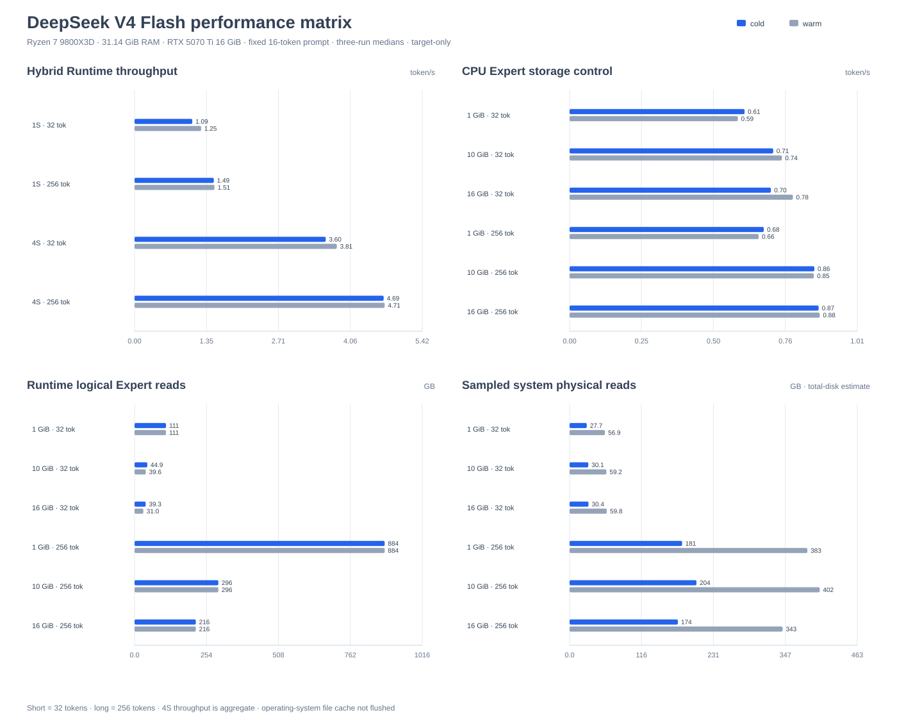
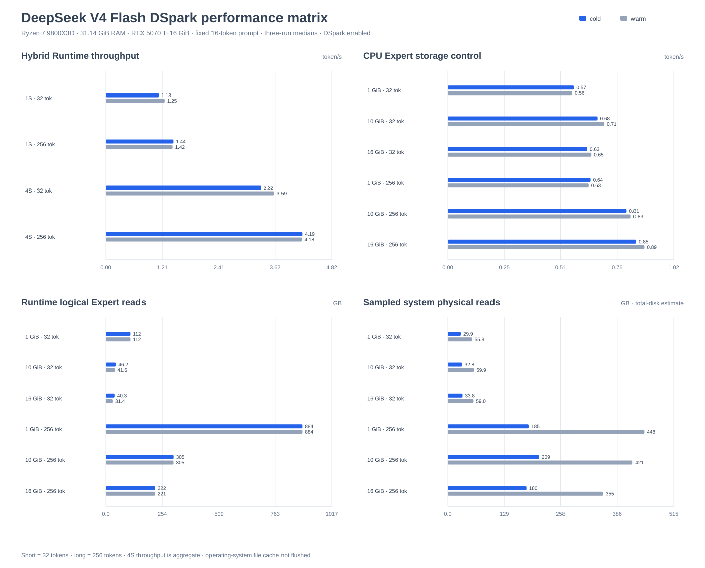

# DeepSeek V4 Flash and DSpark

The built-in `deepseek_v4` adapter runs both official Safetensors packages
directly:

- [`deepseek-ai/DeepSeek-V4-Flash`](https://huggingface.co/deepseek-ai/DeepSeek-V4-Flash)
- [`deepseek-ai/DeepSeek-V4-Flash-DSpark`](https://huggingface.co/deepseek-ai/DeepSeek-V4-Flash-DSpark)

No GGUF conversion or private checkpoint format is required. Both packages
share the same 43-layer target model. The DSpark package additionally exposes
the draft layers and prediction heads used by the optional speculative path.

## Model support

| Area | Implementation |
| --- | --- |
| Package | Official multi-shard Hugging Face Safetensors and `config.json` |
| Dense weights | Blockwise FP8 E4M3 values with E8M0 scales |
| Attention | Latent Attention, 128-token window, ratio-4/128 compression, learned indexing, sinks, and YaRN RoPE |
| Hyper-Connections | Four mHC streams, Sinkhorn mixing, and learned head reduction |
| Experts | FP4 E2M1 routed Experts, FP8 shared Expert, square-root Softplus routing, selection bias, route scaling, and token-hash layers |
| Mixed execution | Vulkan FP8 Dense projections with CPU Attention cache logic, routing, and Experts |
| Expert residency | Automatic, eager, or byte-bounded on-demand |
| Expert I/O | Asynchronous range reads, Windows aligned direct I/O, mmap, and byte-aware ARC |
| Scheduling | Ragged Prefill and staged cross-Session mHC, Attention, routing, and Expert batching |
| Generation | Greedy, temperature, Top-K, Top-P, Min-P, stop tokens, streaming, and optional DSpark speculative decoding |

## Download

Run commands from the repository root and keep either checkpoint in its
ignored model directory:

```powershell
hf download deepseek-ai/DeepSeek-V4-Flash `
  --local-dir .\models\deepseek-v4\DeepSeek-V4-Flash

hf download deepseek-ai/DeepSeek-V4-Flash-DSpark `
  --local-dir .\models\deepseek-v4\DeepSeek-V4-Flash-DSpark
```

The directory must contain `config.json`, `tokenizer.json`,
`encoding/encoding_dsv4.py`, and every Safetensors shard referenced by the
index. DSpark metadata and prediction tensors are required only for the DSpark
package. DeepSeek-V4-Flash's conventional `mtp.0` payload is not used by the
target-model runtime. The encoding file is loaded from the checkpoint and uses
only the Python standard library; this project does not require the official
PyTorch inference dependencies such as `torch`, `tilelang`, or
`fast_hadamard_transform`. Build the examples by following the root
[Quick start](../../README.md#quick-start), then build `ncnn_moe_worker` for
normal text and chat usage.

## Run text or chat

The unified CLI applies the checkpoint's official message encoding and tokenizer
while the native worker remains tokenizer-free:

```powershell
python -m pip install -e ".[hf]"
python tools\ncnn_moe.py run `
  --model .\models\deepseek-v4\DeepSeek-V4-Flash `
  --prompt "Briefly introduce yourself." `
  --max-new-tokens 1024 --stream --backend hybrid
python tools\ncnn_moe.py chat `
  --model .\models\deepseek-v4\DeepSeek-V4-Flash
```

`run` streams tokens and metrics; `chat` keeps a persistent conversation and
supports `/context`, `/compact`, `/reset`, `/new`, `/stats`, and `/tune`.
`--thinking-mode chat` requests a direct answer, while
`--show-reasoning` or `/reasoning` expands the hidden reasoning channel. The
CLI locates `ncnn_moe_worker` in common build directories, or accepts an
explicit path with `--worker`. Scripted runs can add `--no-metrics` to suppress
periodic metrics events while retaining final statistics.

## Run token IDs with the reference runner

Applications that already own tokenization can use the model-named native
reference target. It accepts a model directory followed by prompt token IDs:

```powershell
cmake -S . -B build-ncnn -DNCNN_MOE_BUILD_REFERENCE_RUNNERS=ON
cmake --build build-ncnn --config Release --target ncnn_moe_deepseek_v4 --parallel
.\build-ncnn\Release\ncnn_moe_deepseek_v4.exe `
  .\models\deepseek-v4\DeepSeek-V4-Flash 0 `
  --max-new-tokens 64 --hybrid --report-throughput
```

Use `--prompt-token-file PATH` for long whitespace-separated sequences and
`--stream-token-ids` for incremental machine-readable IDs. These reference
targets are retained for the benchmark harness and CTest fixture; normal text
and chat usage should use `ncnn_moe.py`.

## Sampling

| Option | Meaning |
| --- | --- |
| `--max-new-tokens N` | Maximum generated token count |
| `--temperature T` | `0` selects deterministic greedy decoding |
| `--top-k K` | Keep the highest `K` logits; `0` keeps all |
| `--top-p P` | Nucleus sampling probability threshold |
| `--min-p P` | Remove tokens below a fraction of the highest probability |
| `--seed N` | Sampling seed |
| `--no-speculative` | Disable DSpark speculative decoding when the package provides it |
| `--speculative-confidence P` | Override the DSpark confidence threshold |
| `--speculative-max-draft N` | Bound the number of draft tokens per proposal |

The native runner stops on DeepSeek EOS token `1` and also accepts repeated
`--stop-token ID` options.

## Execution modes

| Option | Execution |
| --- | --- |
| `--cpu` | Portable CPU path |
| `--hybrid` | Vulkan FP8 Dense projections with CPU Attention cache logic, routing, and Experts |
| `--hybrid-prefetch` | Mixed path with explicit CPU cache hints |

`HybridMode::Auto` selects mixed execution for a hardware Vulkan device and
falls back to CPU-only for a software CPU Vulkan implementation.

## Expert memory and storage

The unified CLI can override the automatically sized Expert residency and I/O
plan for a known host:

```powershell
python tools\ncnn_moe.py run `
  --model .\models\deepseek-v4\DeepSeek-V4-Flash `
  --prompt "Briefly introduce yourself." `
  --backend hybrid --expert-memory on-demand `
  --host-memory-mb 28672 --expert-cache-mb 16384 `
  --expert-io-workers 4 --buffered-expert-io `
  --max-new-tokens 1024 --stream
```

| Option | Effect |
| --- | --- |
| `--expert-memory auto\|eager\|on-demand` | Select Expert residency |
| `--cpu-packed-weights auto\|on\|off` | Control the persistent in-memory MXFP4-Q8 CPU weight pack |
| `--host-memory-mb N` | Override the detected host-memory budget |
| `--expert-cache-mb N` | Bound resident Expert pairs in RAM |
| `--expert-io-workers N` | Set asynchronous read concurrency |
| `--mmap-experts` | Map on-demand Expert ranges |
| `--direct-expert-io` | Force aligned direct reads when supported |
| `--buffered-expert-io` | Force conventional buffered reads |
| `--expert-gpu-cache-mb N` | Add an executable Vulkan Expert cache |
| `--expert-gpu-victim-cache-mb N` | Add a compressed-weight Vulkan cache behind the host ARC |
| `--vulkan-device N` | Select one Vulkan device |

Begin with CPU Expert execution and calibrate the intended prompt, context,
and Session mix before assigning memory to Vulkan Expert tiers.

## DSpark speculative decoding

DeepSeek-V4-Flash-DSpark uses its draft layers, Markov/confidence heads, and
transactional latent-cache rollback. It is enabled by default when the package
contains the complete DSpark metadata and tensor set. DeepSeek-V4-Flash has no
DSpark plan and always executes the target model directly. `--no-speculative`
provides a deterministic DSpark baseline for correctness or performance
comparisons. Acceptance rate and net speedup remain workload- and
cache-dependent, so deployment decisions require end-to-end measurement on
the target machine.

For throughput tests with multiple DSpark Sessions, add
`--parallel-speculative` together with `--parallel-sessions N`. Each Session
then executes its own speculative transaction concurrently. The staged
`BatchScheduler` path remains target-only because it submits Prefill and Decode
operations directly rather than calling `Session::generate`.

## Reference performance

The reproduction commands in this section intentionally use the reference
runner for fixed token-ID workloads and Session scheduling. Configure with
`-DNCNN_MOE_BUILD_REFERENCE_RUNNERS=ON` before building that target. Use the
unified CLI above for normal text and chat.

Both package matrices use the same fixed 16-token repeated-BOS prompt, greedy
decoding, three measured processes per cell, and generated-token parity
validation. Short and long windows generate 32 and 256 tokens. Cold cells use
`warmup=0` and `cache-warmup-runs=0`; warm cells add one unreported benchmark
process and configure one in-process cache warm-up before each measured
generation.

The reference host is a Ryzen 7 9800X3D with 31.14 GiB RAM and an RTX 5070 Ti
16 GiB. Hybrid cells use Vulkan FP8 Dense projections, CPU Attention/cache
logic and Experts, buffered Expert I/O, and a 16 GiB host ARC. The storage
control keeps execution on the CPU and sweeps 1, 10, and 16 GiB ARC limits.
Four-Session throughput is aggregate. Flash uses forced staged scheduling;
DSpark uses four independent speculative Sessions so proposals are not
bypassed by the target-only scheduler.

Runtime reads are logical Expert-cache traffic. Sampled system physical reads
come from one-second Windows total-disk counters and include unrelated system
traffic; they are not process-attributed SSD bytes. The operating-system file
cache is not flushed. These measurements validate raw-token execution and
parity, not official tokenizer, chat-template, or text-quality behavior.

### 2026-07-31 focused single-Session measurements

These measurements use greedy target decoding, one outer warm-up process, one
in-process cache warm-up, and three measured processes on the reference host.
The resident profile uses one BOS token and four generated tokens. The
sustained profile uses sixteen BOS tokens, 32 generated tokens, and a 16 GiB
host ARC.

| Profile | Expert I/O | Median throughput | Samples | Expert cache | Runtime reads | Token validation |
| --- | --- | ---: | --- | ---: | ---: | --- |
| Resident, 4 tokens | Direct | **4.367 token/s** | 4.106 / 4.367 / 4.395 | 100% hit | 0 B | `5 223 643 27` in every sample |
| Sustained, 32 tokens | Direct | **1.505 token/s** | 1.485 / 1.505 / 1.524 | 69.4% hit | 31.69 GiB | Identical sequence in every sample |

No repeatable 5 token/s resident result was established by this protocol. In
the accepted resident run, Attention used about 109 ms/token, Experts used
about 104 ms/token, and the Runtime submitted 130 Vulkan command buffers per
token. The sustained run completed with no Expert-I/O fallback.

Reproduce the accepted resident cell from the repository root:

```powershell
python tools\benchmark_runtime.py `
  .\build-ncnn\Release\ncnn_moe_deepseek_v4.exe `
  .\models\deepseek-v4\DeepSeek-V4-Flash `
  --prompt-token-ids 0 --max-new-tokens 4 --temperature 0 `
  --no-speculative --warmup 1 --cache-warmup-runs 1 --repeats 3 `
  --backend hybrid --expert-memory on-demand `
  --host-memory-mb 28672 --expert-cache-mb 16384 `
  --expert-io-workers 4 --direct-expert-io --vulkan-device-index 0
```

This checkpoint has no DSpark plan, so these are target-model results.
The next single-Session ceiling work is persistent Vulkan latent-Attention
state and fewer projection/submission boundaries, followed by CPU MXFP4
bandwidth and thread-placement stabilization. The sustained path additionally
needs earlier Expert availability.

### DeepSeek-V4-Flash matrix



DeepSeek-V4-Flash has no DSpark plan, so every row measures target-model
execution. Regenerate the chart from the JSON report with:

```powershell
python tools\generate_performance_chart.py --family deepseek-v4-flash
```

#### Hybrid Runtime

| Workload | Window | Warm | Throughput | Peak RSS | ARC hit | Runtime reads |
| --- | --- | ---: | ---: | ---: | ---: | ---: |
| 1 Session | 32 tokens | No | **1.088 token/s** | 23.61 GiB | 66.2% | 37.6 GB |
| 1 Session | 32 tokens | Yes | **1.254 token/s** | 23.63 GiB | 69.4% | 34.0 GB |
| 1 Session | 256 tokens | No | **1.492 token/s** | 23.59 GiB | 74.8% | 222.8 GB |
| 1 Session | 256 tokens | Yes | **1.505 token/s** | 23.58 GiB | 75.0% | 221.2 GB |
| 4 staged Sessions | 32 tokens | No | **3.600 aggregate token/s** | 23.55 GiB | 76.3% | 38.4 GB |
| 4 staged Sessions | 32 tokens | Yes | **3.809 aggregate token/s** | 23.59 GiB | 79.1% | 33.9 GB |
| 4 staged Sessions | 256 tokens | No | **4.692 aggregate token/s** | 23.54 GiB | 76.6% | 219.1 GB |
| 4 staged Sessions | 256 tokens | Yes | **4.711 aggregate token/s** | 23.58 GiB | 76.8% | 216.7 GB |

Warm short-window throughput improves from 1.088 to 1.254 token/s for one
Session and from 3.600 to 3.809 aggregate token/s for four Sessions. Long
windows already establish a high ARC hit rate during the measured generation,
so the extra warm-up changes throughput by less than one percent. Four staged
Sessions reach 3.04x the warm single-Session short throughput and 3.13x the
warm long throughput.

#### CPU Expert storage control

| Window | Warm | ARC | Throughput | Peak RSS | ARC hit | Runtime reads | Sampled physical reads |
| --- | ---: | ---: | ---: | ---: | ---: | ---: | ---: |
| 32 tokens | No | 1 GiB | **0.613 token/s** | 8.42 GiB | 0.0% | 111.1 GB | 27.7 GB |
| 32 tokens | No | 10 GiB | **0.713 token/s** | 17.40 GiB | 59.6% | 44.9 GB | 30.1 GB |
| 32 tokens | No | 16 GiB | **0.705 token/s** | 23.32 GiB | 64.6% | 39.3 GB | 30.4 GB |
| 32 tokens | Yes | 1 GiB | **0.589 token/s** | 8.43 GiB | 0.0% | 111.1 GB | 56.9 GB |
| 32 tokens | Yes | 10 GiB | **0.743 token/s** | 17.43 GiB | 64.4% | 39.6 GB | 59.2 GB |
| 32 tokens | Yes | 16 GiB | **0.782 token/s** | 23.33 GiB | 72.1% | 31.0 GB | 59.8 GB |
| 256 tokens | No | 1 GiB | **0.680 token/s** | 8.42 GiB | 0.0% | 883.8 GB | 181.0 GB |
| 256 tokens | No | 10 GiB | **0.857 token/s** | 17.42 GiB | 66.5% | 296.1 GB | 204.1 GB |
| 256 tokens | No | 16 GiB | **0.872 token/s** | 23.32 GiB | 75.5% | 216.4 GB | 174.2 GB |
| 256 tokens | Yes | 1 GiB | **0.662 token/s** | 8.43 GiB | 0.0% | 883.8 GB | 382.6 GB |
| 256 tokens | Yes | 10 GiB | **0.855 token/s** | 17.43 GiB | 66.5% | 296.0 GB | 402.5 GB |
| 256 tokens | Yes | 16 GiB | **0.876 token/s** | 23.32 GiB | 75.5% | 216.4 GB | 342.8 GB |

For the warm storage control, increasing the ARC from 1 to 16 GiB removes
72.1% of short-window Runtime reads and 75.5% of long-window Runtime reads.
Throughput rises by 32.8% and 32.3%, respectively. The sampled physical-read
column is useful for identifying system-level pressure, but it is not expected
to move monotonically with process-local cache traffic.

Reproduce the matrix from the repository root:

```powershell
python tools\benchmark_reference_matrix.py deepseek-v4-flash `
  --runner .\build-ncnn\Release\ncnn_moe_deepseek_v4.exe `
  --model .\models\deepseek-v4\DeepSeek-V4-Flash `
  --output-dir .\build-reports\performance-matrix\deepseek-v4-flash `
  --repeats 3 --short-tokens 32 --long-tokens 256 `
  --parallel-sessions 4 --host-memory-mb 28672 `
  --expert-cache-mb 16384 `
  --storage-cache-mb 1024 10240 16384 `
  --expert-io-workers 4 --vulkan-device-index 0 --resume
```

The aggregate JSON is
`build-reports/performance-matrix/deepseek-v4-flash/report.json`.
For a CPU-only comparison, build the runner with
`-DNCNN_MOE_USE_VULKAN=OFF`, use a separate output directory, and add
`--matrix-backend cpu` to the command. Each CPU case records
`execution_evidence`; the matrix rejects reported GPU execution while keeping
Vulkan-context initialization and system-wide `nvidia-smi` observations
explicitly separate.

### DeepSeek-V4-Flash-DSpark matrix



This matrix enables DSpark with a `0.5` confidence threshold. Every measured
process must report at least one proposal and one draft token or the benchmark
fails. `P/D/A` is the median number of proposals, drafted tokens, and accepted
tokens. Regenerate the chart from the JSON report with:

```powershell
python tools\generate_performance_chart.py --family deepseek-v4-flash-dspark
```

#### Hybrid Runtime

| Workload | Window | Warm | Throughput | Peak RSS | ARC hit | Runtime reads | P/D/A |
| --- | --- | ---: | ---: | ---: | ---: | ---: | ---: |
| 1 Session | 32 tokens | No | **1.131 token/s** | 24.08 GiB | 65.6% | 38.5 GB | 1/5/0 |
| 1 Session | 32 tokens | Yes | **1.254 token/s** | 24.11 GiB | 68.9% | 34.8 GB | 1/5/0 |
| 1 Session | 256 tokens | No | **1.443 token/s** | 24.09 GiB | 74.1% | 229.0 GB | 1/5/0 |
| 1 Session | 256 tokens | Yes | **1.424 token/s** | 24.07 GiB | 74.3% | 227.5 GB | 1/5/0 |
| 4 independent Sessions | 32 tokens | No | **3.318 aggregate token/s** | 24.37 GiB | 91.5% | 38.0 GB | 4/20/0 |
| 4 independent Sessions | 32 tokens | Yes | **3.594 aggregate token/s** | 24.12 GiB | 92.3% | 34.5 GB | 4/20/0 |
| 4 independent Sessions | 256 tokens | No | **4.193 aggregate token/s** | 24.39 GiB | 93.0% | 246.1 GB | 4/20/0 |
| 4 independent Sessions | 256 tokens | Yes | **4.183 aggregate token/s** | 23.46 GiB | 93.1% | 244.6 GB | 4/20/0 |

DSpark executed its proposal path in every measured process, but the fixed
prompt rejected all drafts at the confidence gate before target verification.
It therefore provided no accepted-token acceleration in this matrix. Warm
single-Session short throughput equals Flash at 1.254 token/s, while warm long
throughput is 5.4% lower. The service rows are not a direct DSpark A/B:
Flash uses the staged target scheduler and DSpark uses independently generated
Sessions. Every cell is deterministic across its three measured processes.
The two 256-token Flash service cells choose a different token at output
position 76 from the single-Session and independent-Session path, so the
report does not claim token identity across those scheduling policies.

#### CPU Expert storage control

| Window | Warm | ARC | Throughput | Peak RSS | ARC hit | Runtime reads | Sampled physical reads | P/D/A |
| --- | ---: | ---: | ---: | ---: | ---: | ---: | ---: | ---: |
| 32 tokens | No | 1 GiB | **0.568 token/s** | 8.92 GiB | 0.0% | 111.8 GB | 29.9 GB | 1/5/0 |
| 32 tokens | No | 10 GiB | **0.675 token/s** | 17.91 GiB | 58.7% | 46.2 GB | 32.8 GB | 1/5/0 |
| 32 tokens | No | 16 GiB | **0.628 token/s** | 23.82 GiB | 64.0% | 40.3 GB | 33.8 GB | 1/5/0 |
| 32 tokens | Yes | 1 GiB | **0.561 token/s** | 8.92 GiB | 0.0% | 111.8 GB | 55.8 GB | 1/5/0 |
| 32 tokens | Yes | 10 GiB | **0.706 token/s** | 17.92 GiB | 62.8% | 41.6 GB | 59.9 GB | 1/5/0 |
| 32 tokens | Yes | 16 GiB | **0.647 token/s** | 23.82 GiB | 71.9% | 31.4 GB | 59.0 GB | 1/5/0 |
| 256 tokens | No | 1 GiB | **0.643 token/s** | 8.91 GiB | 0.0% | 884.5 GB | 184.9 GB | 1/5/0 |
| 256 tokens | No | 10 GiB | **0.806 token/s** | 17.92 GiB | 65.5% | 305.1 GB | 208.9 GB | 1/5/0 |
| 256 tokens | No | 16 GiB | **0.849 token/s** | 23.81 GiB | 74.9% | 221.6 GB | 179.8 GB | 1/5/0 |
| 256 tokens | Yes | 1 GiB | **0.635 token/s** | 8.92 GiB | 0.0% | 884.5 GB | 448.0 GB | 1/5/0 |
| 256 tokens | Yes | 10 GiB | **0.825 token/s** | 17.92 GiB | 65.5% | 304.8 GB | 421.3 GB | 1/5/0 |
| 256 tokens | Yes | 16 GiB | **0.886 token/s** | 23.82 GiB | 75.0% | 221.5 GB | 354.5 GB | 1/5/0 |

For the warm short control, the 10 GiB ARC is 25.8% faster than 1 GiB and 9.1%
faster than 16 GiB. The 16 GiB ARC reduces logical reads further, but the
additional DSpark weights and cache residency leave less working-set headroom
on this 31.14 GiB host. The longer workload amortizes that pressure: its
16 GiB warm row is 7.4% faster than 10 GiB and removes 75.0% of the 1 GiB
logical reads. Because no draft token was accepted, these differences are
cache and measurement effects rather than speculative acceleration.

Reproduce the matrix from the repository root:

```powershell
python tools\benchmark_reference_matrix.py deepseek-v4-flash-dspark `
  --runner .\build-ncnn\Release\ncnn_moe_deepseek_v4.exe `
  --model .\models\deepseek-v4\DeepSeek-V4-Flash-DSpark `
  --output-dir .\build-reports\performance-matrix\deepseek-v4-flash-dspark `
  --repeats 3 --short-tokens 32 --long-tokens 256 `
  --parallel-sessions 4 --host-memory-mb 28672 `
  --expert-cache-mb 16384 `
  --storage-cache-mb 1024 10240 16384 `
  --expert-io-workers 4 --vulkan-device-index 0 --resume
```

The aggregate JSON is
`build-reports/performance-matrix/deepseek-v4-flash-dspark/report.json`.
