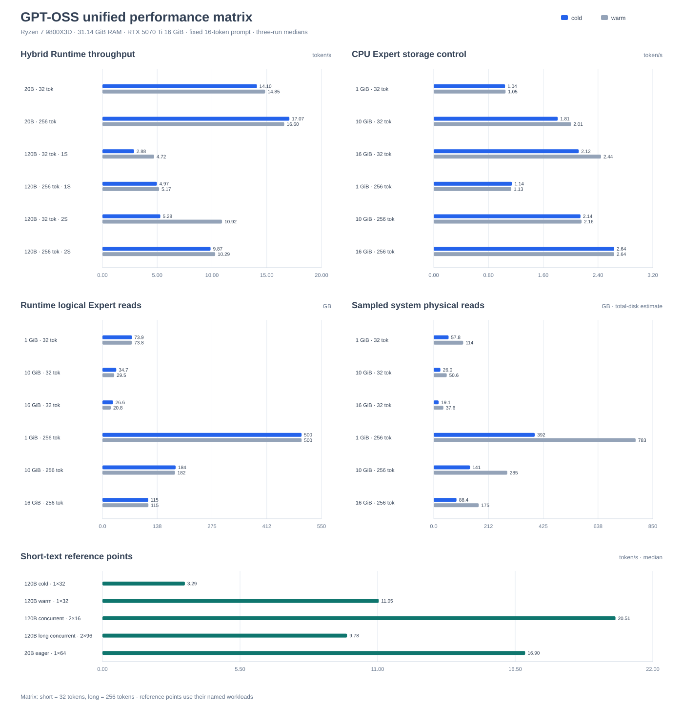

# GPT-OSS

The built-in `gpt_oss` adapter runs the official
[`openai/gpt-oss-20b`](https://huggingface.co/openai/gpt-oss-20b) and
[`openai/gpt-oss-120b`](https://huggingface.co/openai/gpt-oss-120b)
Safetensors packages directly. No GGUF conversion or private checkpoint format
is required.

## Model support

| Area | Implementation |
| --- | --- |
| Package | Official multi-shard Hugging Face Safetensors and `config.json` |
| Dense weights | BF16/F32 with automatic mmap and buffered fallback |
| Attention | RMSNorm, fused QKV+RoPE, adaptive online Decode SDPA, GQA, learned sinks, full/sliding Attention, and YaRN RoPE |
| KV cache | Persistent per-Session BF16 or FP32 CPU cache; FP32 mixed-backend ring |
| Experts | Native MXFP4 blocks and scales with runtime-selected CPU SIMD kernels |
| Mixed execution | Vulkan Dense/Attention with CPU routing and Experts |
| Expert residency | Automatic, eager, or byte-bounded on-demand |
| Expert I/O | Asynchronous range reads, Windows aligned direct I/O, packed sidecar support, and byte-aware ARC |
| Scheduling | Independent Sessions, Expert coalescing, and bounded cross-call micro-batching |
| Generation | Greedy, temperature, Top-K, Top-P, Min-P, stop tokens, and streaming |

GPT-OSS-20B can use eager Expert residency when memory permits. GPT-OSS-120B
is designed to run with on-demand Expert residency on hosts that cannot keep
the complete checkpoint in RAM.

## Download

Run commands from the repository root and keep checkpoints in the ignored
model directories:

```powershell
hf download openai/gpt-oss-20b --local-dir .\models\gpt-oss\gpt-oss-20b
hf download openai/gpt-oss-120b --local-dir .\models\gpt-oss\gpt-oss-120b
```

Each directory must contain `config.json`, `model.safetensors.index.json`, and
every shard referenced by the index. Build the examples by following the root
[Quick start](../../README.md#quick-start), then build `ncnn_moe_worker` for
normal text and chat usage.

## Run text or chat

The unified CLI applies the official Harmony formatting and token decoding while
the native worker remains tokenizer-free:

```powershell
python -m pip install -e ".[gpt-oss]"
python tools\ncnn_moe.py run `
  --model .\models\gpt-oss\gpt-oss-20b `
  --prompt "Reply with exactly: OK" `
  --max-new-tokens 1024 --stream --backend hybrid
python tools\ncnn_moe.py chat `
  --model .\models\gpt-oss\gpt-oss-20b
```

`run` streams tokens and metrics; `chat` keeps a persistent conversation and
supports `/context`, `/compact`, `/reset`, `/new`, `/stats`, and `/tune`. Use
`--show-reasoning` or `/reasoning` when the hidden reasoning channel is needed.
The CLI locates `ncnn_moe_worker` in common build directories, or accepts an
explicit path with `--worker`. Scripted runs can add `--no-metrics` to suppress
periodic metrics events while retaining final statistics.

## Run token IDs with the reference runner

Applications that already own tokenization can use the model-named native
reference target. It accepts a model directory followed by one or more prompt
token IDs:

```powershell
cmake -S . -B build-ncnn -DNCNN_MOE_BUILD_REFERENCE_RUNNERS=ON
cmake --build build-ncnn --config Release --target ncnn_moe_gpt_oss --parallel
.\build-ncnn\Release\ncnn_moe_gpt_oss.exe `
  .\models\gpt-oss\gpt-oss-20b 0 `
  --max-new-tokens 64 --hybrid --report-throughput
```

Use `--stream-token-ids` to print generated IDs as they become available. For
long whitespace-separated sequences, use `--prompt-token-file PATH`. These
reference targets are retained for the benchmark harness and CTest fixture;
normal text and chat usage should use `ncnn_moe.py`.

## Sampling

| Option | Meaning |
| --- | --- |
| `--max-new-tokens N` | Maximum generated token count |
| `--temperature T` | `0` selects deterministic greedy decoding |
| `--top-k K` | Keep the highest `K` logits; `0` keeps all |
| `--top-p P` | Nucleus sampling probability threshold |
| `--min-p P` | Remove tokens below a fraction of the highest probability |
| `--seed N` | Sampling seed |
| `--no-speculative` | Disable model-provided speculative decoding |

The native runner also accepts repeated `--stop-token ID` options.

## Execution modes

| Option | Execution |
| --- | --- |
| `--cpu` | Portable CPU path |
| `--hybrid` | Vulkan Dense/Attention and CPU MXFP4 Experts |
| `--hybrid-prefetch` | Mixed path with explicit CPU cache hints |

`HybridMode::Auto` selects mixed execution for a hardware Vulkan device and
falls back to CPU-only for a software CPU Vulkan implementation. MXFP4 Experts
use CPU arithmetic by default. A non-zero executable Expert GPU cache enables
native Vulkan MXFP4 kernels only when runtime calibration measures an
end-to-end benefit; losing workload buckets return to CPU automatically.

## Expert memory and storage

`Auto` estimates dense and MXFP4 storage before loading weights. It selects
eager Expert residency when the host budget has safe headroom and otherwise
uses a byte-bounded cache backed by exact ranges in the original shards.

| Option | Effect |
| --- | --- |
| `--expert-memory auto\|eager\|on-demand` | Select Expert residency |
| `--host-memory-mb N` | Override the detected host-memory budget |
| `--expert-cache-mb N` | Bound resident Expert pairs in RAM |
| `--expert-io-workers N` | Set asynchronous read concurrency; `0` derives it from Top-K and physical cores |
| `--mmap-experts` | Map on-demand Expert ranges |
| `--direct-expert-io` | Force aligned direct reads when supported |
| `--buffered-expert-io` | Force conventional buffered reads |
| `--expert-gpu-cache-mb N` | Add an executable Vulkan MXFP4 Expert cache |
| `--expert-gpu-victim-cache-mb N` | Add a compressed-weight Vulkan cache behind the host ARC |
| `--vulkan-device N` | Select one Vulkan device |
| `--vulkan-devices N[,N...]` | Supply candidates for capability-weighted layer placement |
| `--parallel-sessions N` | Run independent sequences through the batch scheduler |
| `--scheduler-expert-threads N` | Override Expert threads per scheduler worker |
| `--scheduler-cross-call` | Let the Runtime collector form micro-batches across submissions |

Dense tensors and eager MXFP4 ranges are mapped automatically. On-demand
Experts are read directly into final cache storage without allocating or
zero-filling complete Expert tensors.

The host cache uses byte-aware Adaptive Replacement Cache lists: T1 tracks
recent pairs, T2 tracks repeatedly used pairs, and the B1/B2 ghost histories
adapt the resident split without retaining weight bytes. Cache accounting and
the benchmark report expose resident bytes, ghost hits, reads, cancellations,
and speculative admissions.

The shipped kernel and Vulkan optimization profile is enabled by default. The
experimental prediction/cache controls remain native A/B hooks and are not
exposed by the unified worker. The current 24-token Direct-I/O GPT-OSS-20B triplets measured 98.5% prediction-set
accuracy. Synchronous prediction was neutral at 4.2307 versus 4.2291 token/s;
the bounded worker reached 4.2664 token/s (+0.88%), reduced Cache wait by
1.46%, and completed 529/529 predictions with 0.020 ms target-layer wait.
Logical reads still increased by 0.49%, so this remains an opt-in result. The
[Palm-Infra transfer report](../../memories/repo/investigation-results/palm-infra-transfer-experiment.md)
contains the current protocol. The historical
[DeepSeek/GPT A/B report](../../memories/repo/investigation-results/router-prefetch-cache-io-ab.md)
retains the earlier transition-predictor and read-coalescing screening.

### Optional packed Expert sidecar

For storage-bound GPT-OSS-120B deployments, a derived sidecar can place each
Expert's MXFP4 ranges contiguously:

```powershell
python tools\pack_mxfp4_experts.py .\models\gpt-oss\gpt-oss-120b
```

The tool writes `ncnn-moe-packed-experts.safetensors` atomically and leaves the
official shards unchanged. The loader selects the sidecar automatically when
present and otherwise reads the original shard ranges. The sidecar is an I/O
layout optimization, not a required model conversion.

## GPT-OSS-120B on a constrained-memory host

This configuration is suitable as a starting point for a machine with about
32 GiB RAM and a 16 GiB Vulkan device. The same resource overrides are accepted
by the unified CLI:

```powershell
python tools\ncnn_moe.py run `
  --model .\models\gpt-oss\gpt-oss-120b `
  --prompt "Reply with exactly: OK" `
  --backend hybrid --expert-memory on-demand `
  --host-memory-mb 24576 --expert-cache-mb 16384 `
  --expert-io-workers 4 `
  --max-new-tokens 128 --stream
```

Begin with CPU Expert execution and measure the intended prompt, context, and
Session mix before assigning memory to Vulkan Expert tiers. Larger host ARC
budgets improve route reuse but must leave enough memory for dense mappings,
KV state, execution scratch, and the operating system.

## Reference performance

The public reference protocol uses one fixed 16-token prompt, greedy decoding,
three fresh measured processes per case (and per cache size in the sweep), and
generated-token parity validation. Short
means 32 generated tokens; long means 256. Cold uses
`warmup=0` and `cache-warmup-runs=0`. Warm adds one unreported
benchmark process and configures one in-process cache warm-up before each
measured generation. Warm-up improves repeatability for resident routes but
does not imply that every Expert stays in memory.

Reference host: Ryzen 7 9800X3D, 31.14 GiB RAM, RTX 5070 Ti 16 GiB, AVX-512
MXFP4 Experts, ncnn Vulkan Dense/Attention, and greedy decoding. Two-session
throughput is aggregate.



Representative short-text measurements retained with the matrix are:

| Scenario | Median throughput |
| --- | ---: |
| GPT-OSS-120B cold start, 1 × 32 | 3.294 token/s |
| GPT-OSS-120B warm cache, 1 × 32 | 11.045 token/s |
| GPT-OSS-120B concurrent, 2 × 16 | 20.510 aggregate token/s |
| GPT-OSS-120B long concurrent, 2 × 96 | 9.778 aggregate token/s |
| GPT-OSS-20B eager, 1 × 64 | 16.898 token/s |

These named workloads predate the fixed 32/256-token matrix and should not be
compared as if they were matrix cells.

The hybrid path uses Vulkan Dense/Attention with CPU Experts and the Runtime
scheduler. GPT-OSS-20B uses eager Expert residency; GPT-OSS-120B uses a
bounded host ARC.

| Workload | Window | Warm-up | Throughput | Peak RSS | ARC hit | Runtime reads |
| --- | --- | --- | ---: | ---: | ---: | ---: |
| GPT-OSS-20B, one Session | Short | No | 14.103 token/s | 17.18 GiB | n/a | n/a |
| GPT-OSS-20B, one Session | Short | Yes | 14.855 token/s | 17.18 GiB | n/a | n/a |
| GPT-OSS-20B, one Session | Long | No | 17.069 token/s | 17.18 GiB | n/a | n/a |
| GPT-OSS-20B, one Session | Long | Yes | 16.597 token/s | 17.19 GiB | n/a | n/a |
| GPT-OSS-120B, one Session | Short | No | 2.885 token/s | 23.26 GiB | 66.7% | 24.6 GB |
| GPT-OSS-120B, one Session | Short | Yes | 4.718 token/s | 23.32 GiB | 84.6% | 11.4 GB |
| GPT-OSS-120B, one Session | Long | No | 4.971 token/s | 23.29 GiB | 82.9% | 85.5 GB |
| GPT-OSS-120B, one Session | Long | Yes | 5.171 token/s | 23.35 GiB | 84.3% | 78.7 GB |
| GPT-OSS-120B, two Sessions | Short | No | 5.284 aggregate token/s | 25.24 GiB | 81.6% | 24.4 GB |
| GPT-OSS-120B, two Sessions | Short | Yes | 10.916 aggregate token/s | 25.34 GiB | 96.2% | 2.6 GB |
| GPT-OSS-120B, two Sessions | Long | No | 9.870 aggregate token/s | 25.34 GiB | 91.9% | 70.0 GB |
| GPT-OSS-120B, two Sessions | Long | Yes | 10.295 aggregate token/s | 25.31 GiB | 93.1% | 55.3 GB |

### GPT-OSS-120B CPU Expert storage control

The storage control keeps Expert execution on the CPU and varies the bounded
ARC cache. Each cell is throughput in token/s; the parenthesized value is
Runtime Expert-cache logical reads.

| Expert cache | Short cold | Short warm | Long cold | Long warm |
| --- | ---: | ---: | ---: | ---: |
| 1 GiB | 1.042 (73.9 GB) | 1.050 (73.8 GB) | 1.143 (500.0 GB) | 1.133 (500.0 GB) |
| 10 GiB | 1.812 (34.7 GB) | 2.006 (29.5 GB) | 2.145 (183.7 GB) | 2.160 (182.1 GB) |
| 16 GiB | 2.119 (26.6 GB) | 2.444 (20.8 GB) | 2.637 (115.0 GB) | 2.636 (115.4 GB) |

Sampled system physical reads for the same cells were:

| Window | Warm-up | 1 GiB | 10 GiB | 16 GiB |
| --- | --- | ---: | ---: | ---: |
| Short | No | 57.8 GB | 26.0 GB | 19.1 GB |
| Short | Yes | 114.4 GB | 50.6 GB | 37.6 GB |
| Long | No | 392.1 GB | 140.8 GB | 88.4 GB |
| Long | Yes | 783.5 GB | 285.5 GB | 174.8 GB |

Peak RSS for 1/10/16 GiB is approximately 4.1/13.2/19.2 GiB. System
physical reads are sampled total-disk counters and include unrelated system
traffic; use the JSON report for process and Runtime logical counters.

## Reproduce the benchmark

The matrix driver intentionally uses the reference runner because it exercises
token-ID files, independent Sessions, and benchmark-only scheduler controls.
Configure with `-DNCNN_MOE_BUILD_REFERENCE_RUNNERS=ON` before building that
target. Use the unified CLI above for normal text and chat.

The matrix driver validates parity for every case, runs the cold and warm
policies, and writes per-case reports plus one aggregate JSON file:

```powershell
python tools\benchmark_reference_matrix.py gpt-oss `
  --runner .\build-ncnn\Release\ncnn_moe_gpt_oss.exe `
  --model-20b .\models\gpt-oss\gpt-oss-20b `
  --model-120b .\models\gpt-oss\gpt-oss-120b `
  --output-dir .\build-reports\performance-matrix\gpt-oss `
  --repeats 3 --short-tokens 32 --long-tokens 256 `
  --vulkan-device-index 0
```

The aggregate report is
`build-reports/performance-matrix/gpt-oss/report.json`.
For a CPU-only comparison, build the runner with
`-DNCNN_MOE_USE_VULKAN=OFF`, use a separate output directory, and add
`--matrix-backend cpu` to the command. Each CPU case records
`execution_evidence`; the matrix rejects reported GPU execution while keeping
Vulkan-context initialization and system-wide `nvidia-smi` observations
explicitly separate.
Use `tools/benchmark_runtime.py` directly for a custom prompt or token
window. Keep the model path, warm-up policy, memory budgets, Session count, and
backend fixed when comparing implementation changes. Public reference commands
use the workspace-local paths shown above; external weight locations are not
part of the reproducibility contract.
