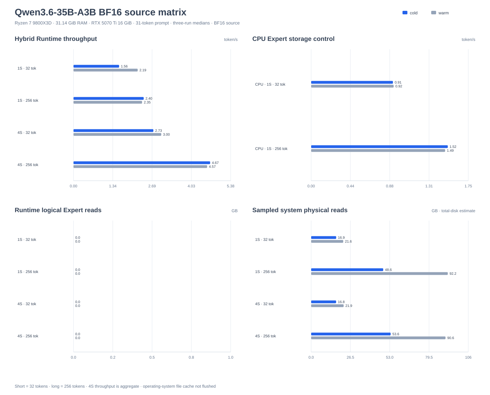
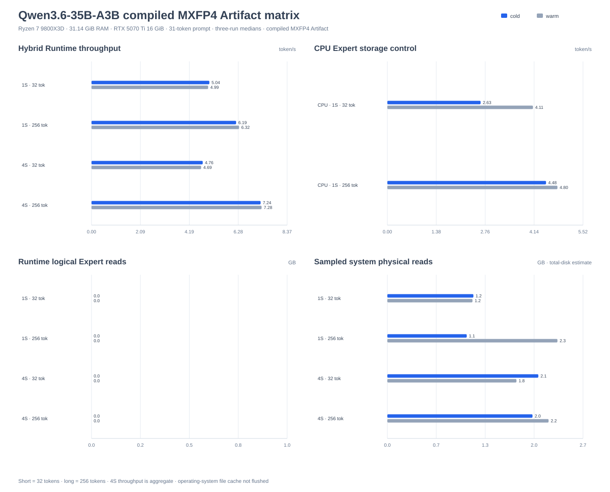

# Qwen3.6-35B-A3B

The built-in `qwen3_5_moe` adapter runs the text backbone from the official
[`Qwen/Qwen3.6-35B-A3B`](https://huggingface.co/Qwen/Qwen3.6-35B-A3B)
Safetensors package directly. The package name is Qwen3.6, while its published
`config.json` identifies the architecture as `qwen3_5_moe`.

No conversion, GGUF file, or generated sidecar is required for the default
BF16 path. An optional compiled MXFP4 routed-Expert Artifact is available as a
separate performance/quality profile. Artifact v3 also admits the package's
one-layer MTP payload as an experimental speculative-decoding option.

## Admitted scope

| Area | Implementation |
| --- | --- |
| Package | Official multi-shard Hugging Face BF16 Safetensors and `config.json` |
| Text architecture | 40 layers in a repeated 3 Gated DeltaNet + 1 gated full-Attention pattern |
| Gated DeltaNet | Depthwise convolution, normalized Q/K, FP32 recurrent state, learned decay/update gates, gated RMSNorm, and persistent per-Session state |
| Full Attention | GQA, partial RoPE, shifted Q/K RMSNorm, output gate, and persistent KV state |
| Experts | 256 BF16 routed Experts by default, or an optional compiled MXFP4 routed-Expert Artifact; normalized Softmax Top-8, one gated BF16 shared Expert per layer, and SiLU activation |
| Norms | Qwen shifted RMSNorm weights for the text backbone |
| Mixed execution | Vulkan Dense projections with CPU recurrent state, Attention/cache logic, routing, and BF16 Experts |
| Speculation | One experimental Qwen MTP layer with sequential target verification and transactional Gated DeltaNet/KV state; opt-in and available only with Artifact v3 |
| Generation | Greedy, temperature, Top-K, Top-P, Min-P, stop tokens, token-ID streaming, and optional MTP |
| Text input | Official tokenizer and `chat_template.jinja` through the Python wrapper |

This admission is text-only. The vision encoder and image/video token path are
not compiled or executed. The package's one-layer MTP payload is compiled only
when the checkpoint-bound Artifact is present; the zero-conversion BF16 profile
remains target-only.

## Download

Run from the repository root and keep the checkpoint in its ignored model
directory:

```powershell
hf download Qwen/Qwen3.6-35B-A3B `
  --local-dir .\models\qwen3.6\Qwen3.6-35B-A3B
```

The directory must contain `config.json`, `tokenizer.json`,
`chat_template.jinja`, the Safetensors index, and every referenced shard.

## Optional compiled Expert Artifact

The default package remains a zero-conversion BF16 model. For higher local
throughput, compile the 40 target-model routed-Expert banks plus the one MTP
routed-Expert bank into a read-optimized OCP MXFP4 sidecar:

```powershell
python tools\compile_qwen3_6_artifact.py `
  .\models\qwen3.6\Qwen3.6-35B-A3B
```

The compiler requires NumPy, leaves every official shard unchanged, and writes
`ncnn-moe-qwen3.6-mxfp4.safetensors` atomically in the model directory. It
interleaves Gate/Up rows for the fused CPU kernel and stores FP4 E2M1 values
with one E8M0 power-of-two scale per 32 values. Use `--workers N` to control
parallel conversion and `--overwrite` to rebuild an existing Artifact.

The adapter automatically selects the fixed sidecar when present. Before
selection it verifies the Artifact version, its binding to the exact local
`config.json` and Safetensors index, all routed layer tensor names, shapes,
dtypes, byte counts, and file ranges. A stale, truncated, or copied Artifact
is rejected with an instruction to rebuild it; removing the sidecar selects
the original BF16 routed Experts again. Verbose runner output and benchmark
JSON identify the active profile as `mxfp4-compiled-artifact-v3` or
`bfloat16-source`.

This Artifact is an explicit weight-quantization profile, not a lossless cache:
it reduces the routed-Expert payload to about 16.34 GiB and
does not promise token parity with the BF16 path. Validate task quality before
deployment. Shared Experts and all non-routed weights remain in their official
storage formats.

## Build

The first-class user-facing native target is the long-lived worker:

```powershell
cmake -S . -B build-ncnn
cmake --build build-ncnn --config Release `
  --target ncnn_moe_worker --parallel
```

Use `-DNCNN_MOE_USE_VULKAN=OFF` for a portable CPU-only build.

## Run text or chat

The unified CLI applies the checkpoint's official tokenizer and chat template,
then streams through `ncnn_moe_worker`:

```powershell
python -m pip install -e ".[hf]"
python tools\ncnn_moe.py run `
  --model .\models\qwen3.6\Qwen3.6-35B-A3B `
  --prompt "Briefly explain mixture-of-experts models." `
  --max-new-tokens 1024 --stream --backend hybrid --no-speculative
python tools\ncnn_moe.py chat `
  --model .\models\qwen3.6\Qwen3.6-35B-A3B
```

Thinking mode uses the checkpoint defaults: temperature 1.0, Top-P 0.95,
Top-K 20, and Min-P 0.0. `--no-thinking` requests the official template's
direct-answer mode. `--show-reasoning` or `/reasoning` expands the hidden
reasoning channel. `--no-speculative` selects the target-only path, and
`--speculative-max-draft N` caps the model-provided draft window when the
checkpoint exposes one. The CLI locates `ncnn_moe_worker` automatically or
accepts `--worker PATH`. Scripted runs can add `--no-metrics` to suppress
periodic metrics events while retaining final statistics.

The Runtime does not currently expose the checkpoint's recommended presence
penalty. Applications that require exact sampling-policy parity should account
for that difference.

## Run token IDs with the reference runner

Applications that already own tokenization can use the model-named native
reference target:

```powershell
cmake -S . -B build-ncnn -DNCNN_MOE_BUILD_REFERENCE_RUNNERS=ON
cmake --build build-ncnn --config Release --target ncnn_moe_qwen3_6 --parallel
.\build-ncnn\Release\ncnn_moe_qwen3_6.exe `
  .\models\qwen3.6\Qwen3.6-35B-A3B 248044 `
  --max-new-tokens 16 --no-speculative --hybrid --report-throughput
```

Use `--prompt-token-file PATH` for a whitespace-separated token sequence and
`--stream-token-ids` for incremental machine-readable IDs. The runner stops on
both published stop tokens: `<|im_end|>` (`248046`) and `<|endoftext|>`
(`248044`). These reference targets are retained for the benchmark harness and
CTest fixture; normal text and chat usage should use `ncnn_moe.py`.

## Execution and memory

| Option | Execution |
| --- | --- |
| `--cpu` | Portable CPU path |
| `--hybrid` | Vulkan Dense projections with CPU stateful Attention and Experts |
| `--hybrid-prefetch` | Same placement with explicit CPU prefetch coordination |
| `--vulkan-device N` | Select one Vulkan device |
| `--host-memory-mb N` | Override the automatic host-memory planning budget |

The official package contains about 60 GiB of routed BF16 Expert tensors.
Without the optional Artifact, these tensors are mapped directly from
Safetensors rather than copied into an additional resident buffer. The
operating system therefore owns physical page residency for the BF16 weights.

With the compiled Artifact, routed Experts use the existing MXFP4 fused CPU
kernels and are eligible for eager mapping or the byte-bounded Expert ARC and
range-I/O path. Qwen's SiLU routed Experts are not admitted to the native
Vulkan MXFP4 Expert backend, so the Artifact does not silently enable a
different GPU arithmetic path. Artifact v3 also contains the MTP routed bank;
each speculative target verification uses transactional standard KV and
Gated DeltaNet state so rejected trailing rows are rolled back exactly.

## Reference performance

The reproduction commands in this section intentionally use the reference
runner for fixed token-ID workloads and multi-Session scheduling. Configure
with `-DNCNN_MOE_BUILD_REFERENCE_RUNNERS=ON` before building that target. Use
the unified CLI above for normal text and chat.

The current accepted high-throughput profile uses the checkpoint-bound MXFP4
routed-Expert Artifact, official BF16 non-Expert weights, Hybrid CPU/Vulkan
execution, eager Experts, greedy decoding, and target-only generation.

The reference host is a Ryzen 7 9800X3D with 31.14 GiB visible RAM and an RTX
5070 Ti 16 GiB on Windows 11. The prompt is the official chat-template encoding
of `Explain the tradeoffs of mixture-of-experts inference in at least 1000
words.` and contains 31 tokens. Values are medians of three fresh measured
processes with no unreported warm-up. Four-Session rows use four independent
Sessions and report aggregate throughput. They do not use staged scheduling or
speculative decoding.

Peak GPU memory is the device-wide `nvidia-smi` delta from the pre-run baseline.
Sequence validation requires every logical Session to produce the same complete
generated sequence in all three measured processes.

| Workload | Throughput | Generation | Peak RSS | Peak GPU delta | Sequence validation |
| --- | ---: | ---: | ---: | ---: | ---: |
| 1 Session x 32 tokens | **8.383 token/s** | 3.817 s | 20.78 GiB | 6.50 GiB | Passed |
| 1 Session x 256 tokens | **12.506 token/s** | 20.470 s | 20.78 GiB | 6.51 GiB | Passed |
| 4 Sessions x 32 tokens | **22.435 aggregate token/s** | 5.705 s | 21.55 GiB | 6.50 GiB | Passed |
| 4 Sessions x 256 tokens | **31.629 aggregate token/s** | 32.376 s | 21.54 GiB | 6.50 GiB | Passed |

The 256-token single-Session measurement attributes 15.880 seconds to
Attention-related execution and 3.558 seconds to Expert execution. It submits
41,216 Vulkan compute commands, or 161 per generated token, with 3.847 seconds
attributed to submit/wait boundaries. Every accepted eager measurement reports
zero Runtime logical Expert-read bytes.

The current high-throughput path uses packed official-BF16 Vulkan Linear
operators and fuses projections that consume the same activation. The next
single-Session ceiling work is to keep the shared-Expert activation and Down
projection resident on Vulkan, keep recurrent Gated DeltaNet state closer to
the device execution chain, reduce full-Attention and residual/RMSNorm command
boundaries, and add prefill-specific recurrent and matrix kernels. Direct
storage I/O is not the bottleneck for this eager profile.

### BF16 source admission matrix



Regenerate the chart from the matrix JSON with:

```powershell
python tools\generate_performance_chart.py --family qwen3.6-35b-a3b
```

The accepted BF16 matrix uses the official chat template for the fixed prompt
`Explain the tradeoffs of mixture-of-experts inference in at least 1000
words.`. It encodes to 31 input tokens. Every cell uses greedy decoding with
speculation disabled and reports the median of three independent measured
processes. Short and long windows generate 32 and 256 tokens. Cold cells use
`warmup=0` and `cache-warmup-runs=0`; warm cells add one unreported benchmark
process and one in-process cache warm-up before every measured generation.

The reference host is a Ryzen 7 9800X3D with 31.14 GiB visible RAM and an RTX
5070 Ti 16 GiB on Windows 11. Hybrid execution places Dense projections on
Vulkan while Gated DeltaNet state, Attention/cache logic, routing, and BF16
Experts remain on the CPU. Four-Session rows use forced staged scheduling and
report aggregate throughput.

The operating-system file cache was not flushed. Since the routed BF16 Expert
mapping is larger than host RAM, warm means only that the stated warm-up
protocol ran; it does not mean that all Expert pages remained resident. Peak
GPU values below are device-wide `memory.used` deltas from the pre-run
baseline, sampled by `nvidia-smi`; they are not process-attributed.

| Workload | Window | Warm | Throughput | Generation | Peak RSS | Peak GPU delta |
| --- | --- | ---: | ---: | ---: | ---: | ---: |
| CPU, 1 Session | 32 tokens | No | **0.912 token/s** | 35.10 s | 25.85 GiB | - |
| CPU, 1 Session | 32 tokens | Yes | **0.919 token/s** | 34.80 s | 26.13 GiB | - |
| CPU, 1 Session | 256 tokens | No | **1.523 token/s** | 168.08 s | 26.70 GiB | - |
| CPU, 1 Session | 256 tokens | Yes | **1.493 token/s** | 171.42 s | 26.75 GiB | - |
| Hybrid, 1 Session | 32 tokens | No | **1.560 token/s** | 20.51 s | 26.00 GiB | 8.48 GiB |
| Hybrid, 1 Session | 32 tokens | Yes | **2.195 token/s** | 14.58 s | 25.80 GiB | 8.48 GiB |
| Hybrid, 1 Session | 256 tokens | No | **2.402 token/s** | 106.59 s | 26.40 GiB | 8.48 GiB |
| Hybrid, 1 Session | 256 tokens | Yes | **2.345 token/s** | 109.16 s | 26.33 GiB | 8.48 GiB |
| Hybrid, 4 staged Sessions | 32 tokens each | No | **2.732 aggregate token/s** | 46.85 s | 25.87 GiB | 8.45 GiB |
| Hybrid, 4 staged Sessions | 32 tokens each | Yes | **3.001 aggregate token/s** | 42.65 s | 25.88 GiB | 8.48 GiB |
| Hybrid, 4 staged Sessions | 256 tokens each | No | **4.674 aggregate token/s** | 219.09 s | 26.18 GiB | 8.45 GiB |
| Hybrid, 4 staged Sessions | 256 tokens each | Yes | **4.571 aggregate token/s** | 224.01 s | 26.42 GiB | 8.48 GiB |

Every measured process produced its full requested window. The matrix also
checked each logical Session against one common reference: all 12 logical
32-token sequences and all 12 logical 256-token sequences matched exactly
across CPU, hybrid, cold, warm, and four-Session execution. The 256-token
service cells reported 255 staged batches and 1,020 staged requests. They
reduced 366,080 logical Expert batches to 91,520 physical batches, an exact
4:1 coalescing ratio.

Reproduce the matrix from the repository root:

```powershell
python tools\benchmark_reference_matrix.py qwen3.6-35b-a3b `
  --runner .\build-ncnn\Release\ncnn_moe_qwen3_6.exe `
  --model .\models\qwen3.6\Qwen3.6-35B-A3B `
  --output-dir .\build-reports\performance-matrix\qwen3.6-35b-a3b `
  --repeats 3 --short-tokens 32 --long-tokens 256 `
  --parallel-sessions 4 --vulkan-device-index 0 --resume
```

Use `--model-revision REVISION` when the local checkpoint revision is known.
The accepted local directory did not expose a source revision, so this run's
case reports record `model_revision` as null. The aggregate JSON is
`build-reports/performance-matrix/qwen3.6-35b-a3b/report.json`.
For a CPU-only comparison, build the runner with
`-DNCNN_MOE_USE_VULKAN=OFF`, use a separate output directory, and add
`--matrix-backend cpu` to the command. Each CPU case records
`execution_evidence`; the matrix rejects reported GPU execution while keeping
Vulkan-context initialization and system-wide `nvidia-smi` observations
explicitly separate.

### Compiled Artifact admission matrix



Regenerate the chart from the Artifact matrix JSON with:

```powershell
python tools\generate_performance_chart.py --family qwen3.6-35b-a3b-mxfp4-v2
```

The optional Artifact completed the same 12-cell matrix with speculation
disabled. The recorded full matrix used Artifact v2; Artifact v3 preserves the
same target-bank conversion and adds the MTP routed bank. Values are
three-process medians:

| Workload | Window | Cold | Warm |
| --- | ---: | ---: | ---: |
| CPU, 1 Session | 32 | 2.633 token/s | 4.112 token/s |
| CPU, 1 Session | 256 | 4.481 token/s | 4.804 token/s |
| Hybrid, 1 Session | 32 | 5.045 token/s | 4.991 token/s |
| Hybrid, 1 Session | 256 | 6.190 token/s | 6.316 token/s |
| Hybrid, 4 staged Sessions | 32 each | 4.761 aggregate token/s | 4.692 aggregate token/s |
| Hybrid, 4 staged Sessions | 256 each | 7.237 aggregate token/s | 7.281 aggregate token/s |

All 12 cells completed and the matrix-level logical-Session output checks
passed. This establishes execution consistency inside the Artifact profile; it
does not establish quality parity between BF16 and MXFP4 routed weights.

### Speculative-decoding status

MTP remains experimental and opt-in. The runner and Python wrapper default to
target-only generation. Batched verification with the packed-BF16 target path
does not currently preserve the complete greedy sequence. Sequential target
verification preserves the required token and transactional-state behavior,
but it is not the recommended performance profile. Use `--speculative` only
for focused validation and `--no-speculative` for the documented target-only
path.

### Reproduce the current profile

From the repository root, reproduce the accepted 256-token single-Session
measurement with:

```powershell
$prompt = @(
  248045, 846, 198, 814, 20139, 279, 6355, 31410, 314, 20340, 8404,
  17830, 15089, 42903, 303, 506, 3140, 220, 16, 15, 15, 15, 4105, 13,
  248046, 198, 248045, 74455, 198, 248068, 198
)
python tools\benchmark_runtime.py `
  .\build-ncnn\Release\ncnn_moe_qwen3_6.exe `
  .\models\qwen3.6\Qwen3.6-35B-A3B `
  --prompt-token-ids $prompt --max-new-tokens 256 `
  --temperature 0.0 --no-speculative `
  --backend hybrid --expert-memory eager --repeats 3 `
  --json-output .\build-reports\qwen3.6-target-256.json
```

Add `--parallel-sessions 4 --parallel-independent` for the four-Session
measurement. The benchmark rejects differing generated sequences between
measured repeats. Machine-readable reports stay in ignored build-local
directories.

## Validation boundary

Admission validation covers configuration recognition, graph compilation,
all 40 text layers, state continuation across Gated DeltaNet calls, official
chat-template tokenization, and real-checkpoint CPU and mixed-backend
generation, including the native 32/256-token matrix above. Artifact
validation additionally covers its checkpoint identity, the target and MTP
routed banks, and repeated-process token stability for the stated 32/256-token
greedy protocol. Experimental MTP validation covers
speculative KV/recurrent-state transactions and exact sequential verification;
it is not a current performance recommendation. Validation does not establish:

- vision encoder, image, or video support;
- exact parity with a Transformers reference implementation;
- exact token parity between the BF16 and quantized Artifact profiles;
- the published 262,144-token context limit under long-context workloads; or
- throughput or memory behavior on hardware other than the stated reference
  host and protocol.

The accepted matrices are device-specific native Runtime measurements, not
portable deployment-performance guarantees.
